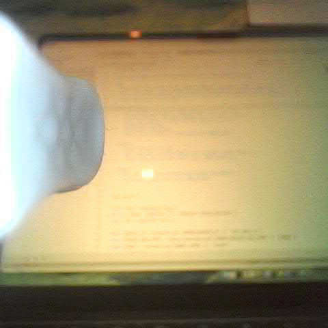

# suear-mjpeg-over-adb



Streams the Suear live-preview video over USB by capturing the phone’s UDP traffic and serving it as MJPEG on your computer.

## What it does

- Runs `tcpdump` on the Android phone to capture the Suear camera UDP stream (as a PCAP file on the device).
- Streams that PCAP file over a device-local TCP socket (`tail -f … | nc -l`).
- Uses `adb forward` to bring that TCP socket to `127.0.0.1:<port>` on your computer.
- Parses Ethernet/IP/UDP frames from the PCAP stream, extracts UDP payloads, and reassembles JPEG frames.
- Serves: `http://127.0.0.1:8081/mjpeg` (continuous MJPEG stream)

This avoids trying to forward UDP directly (ADB port forwarding is TCP/Unix-socket only).

## Code layout / pipeline

The parsing path is implemented as a small Node.js Transform-stream pipeline:

`pcap bytes` → `pcap packets` → `udp datagrams` → `suear payload bytes` → `jpeg frames`

Modules:

- `bin/index.js`: entrypoint; ADB/tcpdump orchestration + MJPEG HTTP server.
- `lib/pcap-parser.js`: PCAP parsing (`PcapStreamParser`) + stream wrapper (`PcapParserTransform`).
- `lib/udp-decoder.js`: Ethernet/IPv4/UDP decode + stream wrapper (`UdpDecoderTransform`).
- `lib/suear-payload.js`: Suear-specific filtering (src IP/port) and payload header stripping (`SuearPayloadTransform`).
- `lib/jpeg-assembler.js`: JPEG frame reassembly (`JpegAssembler`) + stream wrapper (`JpegAssemblerTransform`).
- `lib/byte-queue.js`, `lib/buffer-utils.js`: internal buffer helpers.

## Prereqs

- `adb` working (USB debugging enabled).
- Root on the phone (the script runs `tcpdump` via `su`).
- `tcpdump`, `tail`, `nc` available on the phone (`/system/bin/tcpdump` is used by default).
- The phone is connected to the Suear camera’s Wi‑Fi so it receives the UDP preview packets.

## Usage

```sh
cd suear-mjpeg-over-adb
npm start
```

Then open:

- `http://127.0.0.1:8081/mjpeg`

## Configuration (env vars)

- `SUEAR_DEVICE_IP` (default `192.168.1.1`)
- `SUEAR_DEVICE_SRC_PORT` (default `10006`)
- `SUEAR_IFACE` (default `wlan0`)
- `SUEAR_HTTP_PORT` (default `8081`)
- `SUEAR_FORWARD_PORT` (default `27183`) (host/device TCP port used only for the PCAP tunnel)
- `SUEAR_DEBUG=1` for extra logging

Example:

```sh
SUEAR_HTTP_PORT=8099 SUEAR_DEBUG=1 npm start
```

## Notes / troubleshooting

- If `/mjpeg` stays blank, start live preview in the Suear app (so the phone is actually receiving the UDP stream).
- If `adb forward` succeeds but no bytes arrive, the on-device tools (`tcpdump`, `nc`) may be missing, or `su` may be denied.
- The capture file is created on-device at `/data/local/tmp/suear-stream-<forwardPort>.pcap`.
